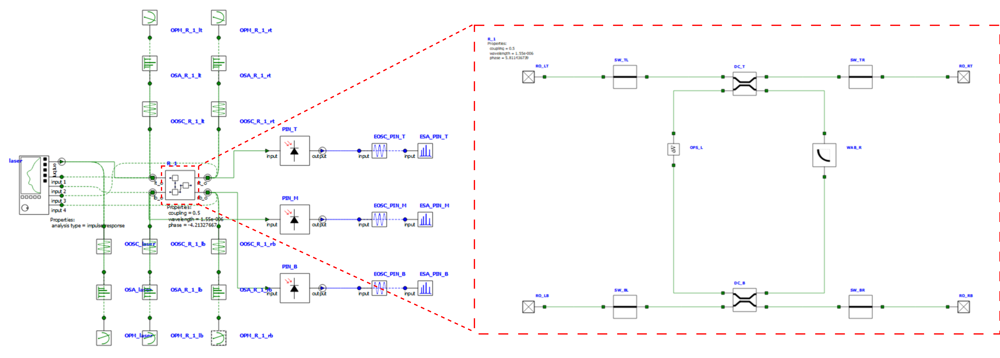
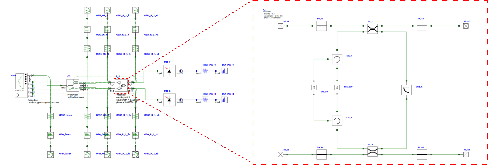

# Non-Reciprocal Ring Resonators

This is the official repository for the paper: <br>
[Integrated non-reciprocal magneto-optics with ultra-high endurance for photonic in-memory computing](https://www.nature.com/articles/s41566-024-01549-1).

## Requirements
The following packages are required to run the simulation:
  - [Lumerical Interconnect](https://www.lumerical.com/products/interconnect/)
  - [Matlab](https://www.mathworks.com/products/matlab.html)
  - [Python 3.6+](https://www.python.org/downloads/) 
    - The required python packages are listed in [requirements.txt](requirements.txt) file.

## Run the simulation

### Run the simulation using the following steps:

1. Create lsf file for the simulation using `lsf.sh`
1. The main lsf runfile: `out/lsf/**/*.slurm.lsf`
    - using Lumerical Interconnect directly. (not recommended for large simulations)
    - using `out/lsf/**/*.lsf.slurm` on a cluster.
1. Compile the data
    - using `src/compile_data.py -opmc -l out/results/<simulation_results>`
    - using `src/lsf/*.compile.slurm` on a cluster.
1. The results are stored in `out/results/` directory.

### Plot the results using the following steps: 
**Note**: all the scripts are in `src/plot_scripts/` directory.

- `simulation_1.py` is used to plot the results of simulation 1.
- `simulation_2_3.py` is used to plot the results of simulation 2 and 3.
- `simulation_2_5_to_mat.ipynb` converts the results of simulation 2 and 5 to `.mat` files.
    - `figure_1.m` and `figure_2.m` are used to plot the results of simulation 2, 3, 4 and 5.

### Extra
- `src/plot_scripts/cache_this.py` is used to pre cache the results of the simulation for faster plotting.

## Device Architecture
### Reciprocal Ring Resonator

### Non-Reciprocal Ring Resonator


## Cite

We would appreciate if you cite the following paper in your publications if you find this code useful:

```bibtex
@article{pintus_integrated_2024,
	title = {Integrated non-reciprocal magneto-optics with ultra-high endurance for photonic in-memory computing},
	issn = {1749-4885, 1749-4893},
	url = {https://www.nature.com/articles/s41566-024-01549-1},
	doi = {10.1038/s41566-024-01549-1},
	abstract = {Abstract
            Processing information in the optical domain promises advantages in both speed and energy efficiency over existing digital hardware for a variety of emerging applications in artificial intelligence and machine learning. A typical approach to photonic processing is to multiply a rapidly changing optical input vector with a matrix of fixed optical weights. However, encoding these weights on-chip using an array of photonic memory cells is currently limited by a wide range of material- and device-level issues, such as the programming speed, extinction ratio and endurance, among others. Here we propose a new approach to encoding optical weights for in-memory photonic computing using magneto-optic memory cells comprising heterogeneously integrated cerium-substituted yttrium iron garnet (Ce:YIG) on silicon micro-ring resonators. We show that leveraging the non-reciprocal phase shift in such magneto-optic materials offers several key advantages over existing architectures, providing a fast (1 ns), efficient (143 fJ per bit) and robust (2.4 billion programming cycles) platform for on-chip optical processing.},
	language = {en},
	urldate = {2024-12-04},
	journal = {Nature Photonics},
	author = {Pintus, Paolo and Dumont, Mario and Shah, Vivswan and Murai, Toshiya and Shoji, Yuya and Huang, Duanni and Moody, Galan and Bowers, John E. and Youngblood, Nathan},
	month = oct,
	year = {2024},
}
```

Or in textual form:

```text
Pintus, Paolo, Mario Dumont, Vivswan Shah, Toshiya Murai, Yuya Shoji, 
Duanni Huang, Galan Moody, John E. Bowers, and Nathan Youngblood. "Integrated 
non-reciprocal magneto-optics with ultra-high endurance for photonic in-memory 
computing." Nature Photonics (2024): 1-9.
```

## Patent

The device architectures is patented. Please contact the authors for more information.

