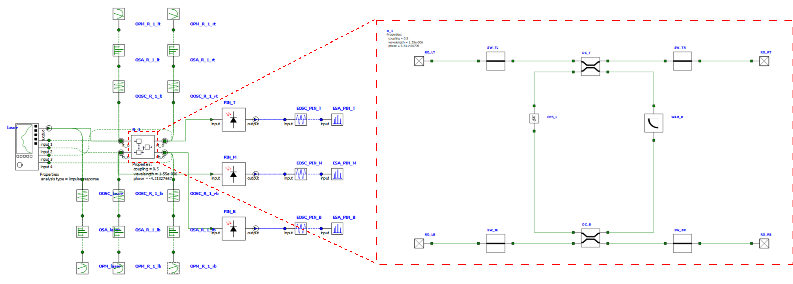
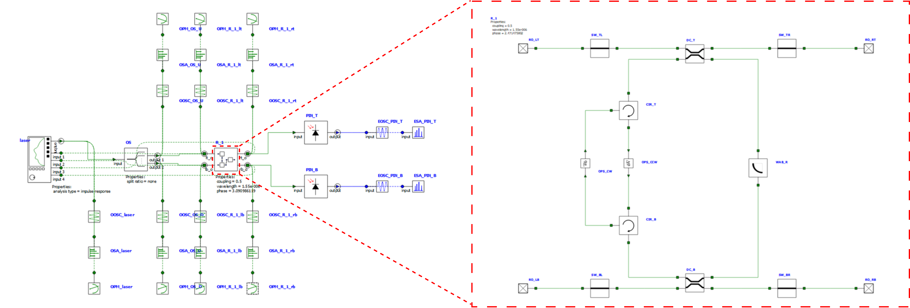

# Non-Reciprocal Ring Resonators

<!-- This is the official repository for the paper: [Non-Reciprocal Ring Resonators](https://arxiv.org/abs/2103.16375). -->

## Requirements
The following packages are required to run the simulation:
  - [Lumerical Interconnect](https://www.lumerical.com/products/interconnect/)
  - [Matlab](https://www.mathworks.com/products/matlab.html)
  - [Python 3.6+](https://www.python.org/downloads/) 
    - The required python packages are listed in [requirements.txt](requirements.txt) file.

## Run the simulation

### Run the simulation using the following steps:

1. Create lsf file for the simulation using `lsf.sh`
1. The main lsf runfile: `out/lsf/**/*.slurm.lsf`
    - using Lumerical Interconnect directly. (not recommended for large simulations)
    - using `out/lsf/**/*.lsf.slurm` on a cluster.
1. Compile the data
    - using `src/compile_data.py -opmc -l out/results/<simulation_results>`
    - using `src/lsf/*.compile.slurm` on a cluster.
1. The results are stored in `out/results/` directory.

### Plot the results using the following steps: 
**Note**: all the scripts are in `src/plot_scripts/` directory.

- `simulation_1.py` is used to plot the results of simulation 1.
- `simulation_2_3.py` is used to plot the results of simulation 2 and 3.
- `simulation_2_5_to_mat.ipynb` converts the results of simulation 2 and 5 to `.mat` files.
    - `figure_1.m` and `figure_2.m` are used to plot the results of simulation 2, 3, 4 and 5.

### Extra
- `src/plot_scripts/cache_this.py` is used to pre cache the results of the simulation for faster plotting.

## Device Architecture
### Reciprocal Ring Resonator

### Non-Reciprocal Ring Resonator


<!-- ## Cite

We would appreciate if you cite the following paper in your publications if you find this code useful:

```bibtex
```

Or in textual form:

```text
``` -->

## Patent

The device architectures is patented. Please contact the authors for more information.

